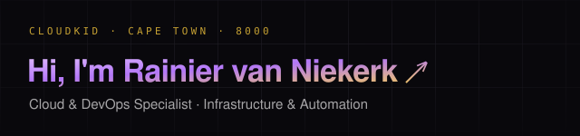

  

<h2> ☁ Cloud & DevOps Specialist | ⚙ Infrastructure & Automation </h2>

I’m a cloud enthusiast, engineer, and problem solver passionate about building efficient, scalable solutions. From cloud architecture to scripting and automation, I love simplifying complexity and enabling teams to deliver faster, safer, and repeatable outcomes. Deeply into <strong>Cloud Infrastructure</strong> & <strong>Infrastructure Automation</strong>.

### 🌐 Explore My Journey

- **Personal Website**: [rainier.cloudkid.link](https://rainier.cloudkid.link)

### 🔧 Technologies & Tools

- **Languages**: PowerShell, C#, Bash, SQL, Scriban, PromQL
- **Cloud**: Azure, Kubernetes, Terraform
- **DevOps**: Docker, Nginx, CI/CD
- **Databases**: SQL Server, Entity Framework

### 🔭 Current Projects

- [Korban Ministries](https://korbanministries.co.za/): Online Gospel Ministry platform (content & delivery infrastructure).
- [Online Webinar Platform](https://online.cloudkid.link/): Self-hosted webinar/event delivery site (automation & reliability focus).
- [Wedding Photo Gallery](https://wedding.cloudkid.link/): Static optimized media gallery hosted via edge delivery.

### 💬 Get in Touch

- **Website**: [rainier.cloudkid.link](https://rainier.cloudkid.link)
- **LinkedIn**: [LinkedIn Profile](https://www.linkedin.com/in/rainier-cloudkid/)

 
 

  

